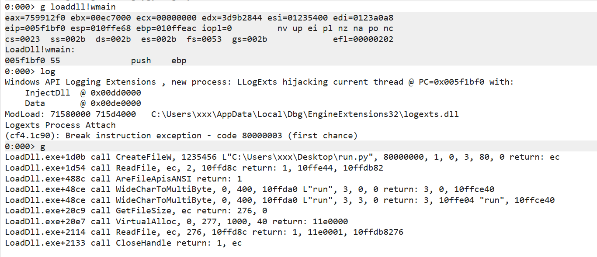

# Logexts

Logexts 是一个 WinDBG 调试扩展 DLL，通过 Microsoft Detours 实现 API Hook，记录被调试进程的 Windows API 调用。函数参数和返回值根据二进制清单文件（`.lgm` 文件）定义的签名进行格式化输出。



## 功能特性

- **API Hook 注入**：通过 `logi` 命令将日志记录模块注入到被调试进程
- **多架构支持**：同时支持 32位（x86）和 64位（x64）调试
- **二进制清单格式**：使用紧凑的二进制 `.lgm` 文件存储 API 签名，读取高效
- **JSON 清单编辑器**：可通过 ManifestEditor 将 JSON 格式的 API 定义转换为二进制格式
- **输出隔离**：使用 `OutputDebugString` 输出，不污染被调试进程的标准输出
- **模块枚举**：直接遍历 PEB 获取模块列表，避免调用外部 API 污染日志
- **过滤配置**：支持按 API 前缀和 DLL 名称排除不需要记录的调用

## 项目结构

```
Logexts/
├── logexts/              # WinDBG 扩展 DLL 核心代码
│   ├── logexts.cpp       # 入口点 (logi, logir, logd 命令)
│   ├── Logger.cpp/h      # Hook 管理与模块枚举
│   ├── FunctionWriter.cpp/h # 参数/返回值格式化输出
│   ├── ModuleList.cpp/h  # PEB 遍历模块列表
│   ├── loghook.asm       # 32位汇编 trampoline
│   └── loghook64.asm      # 64位汇编 trampoline
├── Manifest/             # 静态库：读取/写入 .lgm 二进制清单
│   └── Manifest.h        # 清单文件格式定义
├── ManifestEditor/       # 独立工具：将 JSON 转换为二进制 .lgm
│   └── ManifestEditor.cpp
├── loader/                # 测试用注入程序
└── conf/                  # 静态清单文件
    ├── manifest.json      # JSON 格式 API 定义（源码）
    └── LogManifest.lgm     # 编译后的二进制清单
```

## 构建

### 环境要求

- Visual Studio 2019
- Windows SDK 10.0
- vcpkg（依赖：Detours、Boost、nlohmann/json）

### 编译命令

```batch
:: 64位 Release
msbuild Logexts.sln /p:Configuration=Release /p:Platform=x64

:: 32位 Release
msbuild Logexts.sln /p:Configuration=Release /p:Platform=Win32
```

### 输出产物

| 平台 | 配置  | 路径               | 文件             |
|------|-------|--------------------|------------------|
| x64  | Debug | x64/Debug/         | logexts64.dll    |
| x64  | Release | x64/Release/     | logexts64.dll    |
| x86  | Debug | Debug/             | logexts32.dll    |
| x86  | Release | Release/         | logexts32.dll    |

`LogManifest.lgm` 会复制到与 DLL 相同的输出目录。

## 使用方法

### WinDBG 命令

```
.load logexts64.dll   :: 加载 64位扩展
.load logexts32.dll   :: 或 32位扩展

logi                   :: 注入日志模块到被调试进程
g                      :: 继续执行
logir                  :: 在注入点恢复线程执行
logd                   :: 切换调试输出模式
```

### 完整工作流程

```
1. 启动 WinDBG 附加目标进程（或用 -g 参数启动）
2. .load logexts64.dll
3. 设置断点（如 bp user32!MessageBoxW）
4. g
5. 进程断下后，输入 logi 注入日志模块
6. g 继续执行
7. 当断点触发时，输入 logir 恢复注入线程
8. 继续执行，API 调用会被记录
```

### 查看输出

日志通过 `OutputDebugString` 输出，使用以下方式查看：

- WinDBG：`dbgout` 命令
- Sysinternals **DebugView**：实时捕获
- 其他支持 DbgPrint 的调试器

## 清单文件格式

### 二进制格式 (.lgm)

文件头魔数：`\x25\x52\x22\x00`，头部大小 `0x42c`。

包含以下数据段：
- **Types**：类型定义（基础类型、结构体等）
- **Categories**：API 分类（kernel/user32/GDI 等）
- **Structs**：结构体成员声明
- **UUIDs**：COM 接口 UUID
- **Functions**：函数签名（模块名、参数、返回值类型）

### JSON 格式（源码）

`conf/manifest.json` 定义了 API 签名：

```json
{
  "categories": [
    { "name": "kernel" },
    { "name": "GDI" },
    ...
  ],
  "functions": [
    {
      "name": "MessageBoxW",
      "moduleName": "user32.dll",
      "parametersDeclarations": [
        { "name": "hWnd", "typeIndex": 7, "pointerRank": 1, "number": 1 },
        { "name": "lpText", "typeIndex": 2, "pointerRank": 1, "number": 2 },
        ...
      ],
      "returnTypeIndex": 7
    },
    ...
  ]
}
```

### 编译清单

将 JSON 转换为二进制格式：

```batch
ManifestEditor\x64\Release\ManifestEditor.exe ^
    --input conf\manifest.json ^
    --output conf\LogManifest.lgm
```

## 配置

在 DLL 同目录下创建 `Logexts.json`：

```json
{
    "excludeApis": ["api_prefix_to_skip"],
    "excludeDlls": ["module.dll"],
    "isDebug": false
}
```

| 字段 | 类型 | 说明 |
|------|------|------|
| excludeApis | string[] | 排除的 API 前缀（不区分大小写） |
| excludeDlls | string[] | 排除的 DLL 名称 |
| isDebug | bool | 是否启用调试输出 |

## 添加新 API

1. 编辑 `conf/manifest.json`，添加函数定义（参考现有条目格式）
2. 使用 ManifestEditor 编译为 `conf\LogManifest.lgm`
3. 重新编译 `logexts` 项目
4. 确保新的 `LogManifest.lgm` 复制到 DLL 目录

## 技术细节

### Hook 机制

使用 Microsoft Detours 实现 API 重定向：

- **32位** (`loghook.asm`)：栈传递参数，trampoline 16 字节
- **64位** (`loghook64.asm`)：RCX/RDX/R8/R9 传递，shadow space 保留，trampoline 32 字节

### 模块枚举

为避免日志中出现自身的模块调用，模块枚举直接遍历 PEB（Process Environment Block），不调用任何外部 DLL。

### 线程安全

Logger 使用临界区（Critical Section）保护共享数据，多线程场景下安全。

## 局限性

- 当前版本不支持 64位系统上的 32位进程调试（需要 x86 WinDBG）
- 清单文件需手动维护，不支持从 PE 文件自动提取签名
- 仅支持 stdcall/fastcall 约定的函数

## 许可证

项目私有，仅供内部使用。